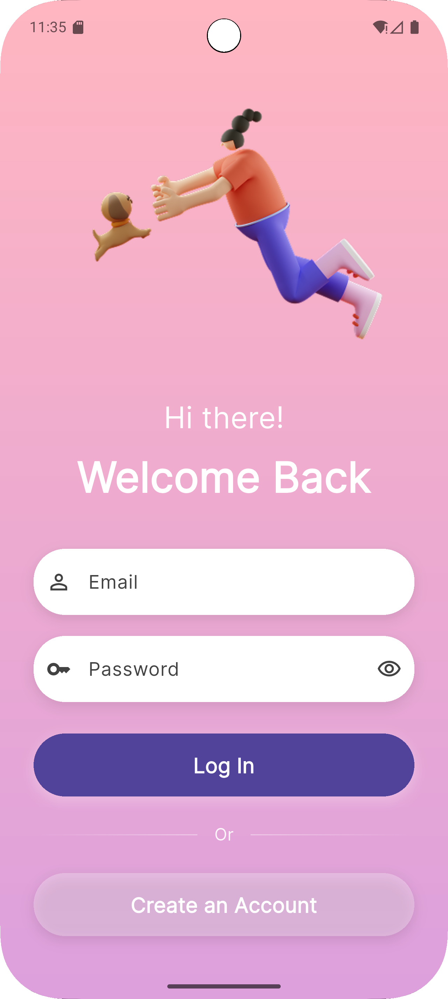
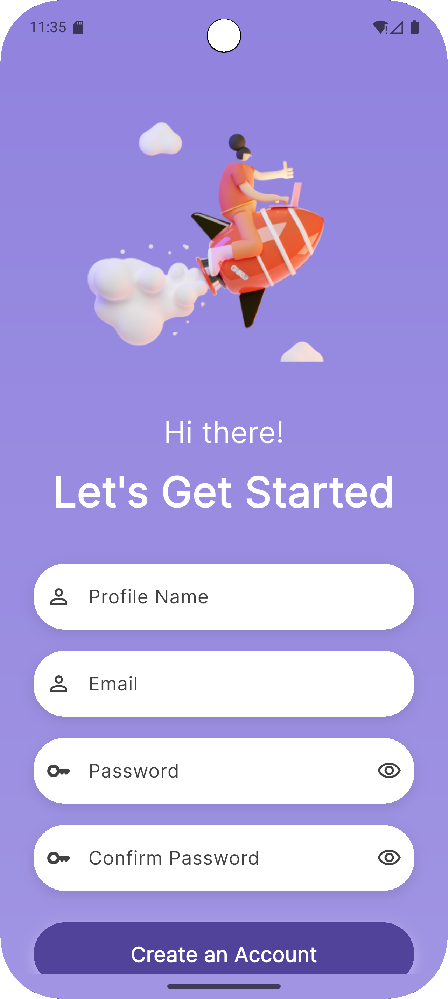
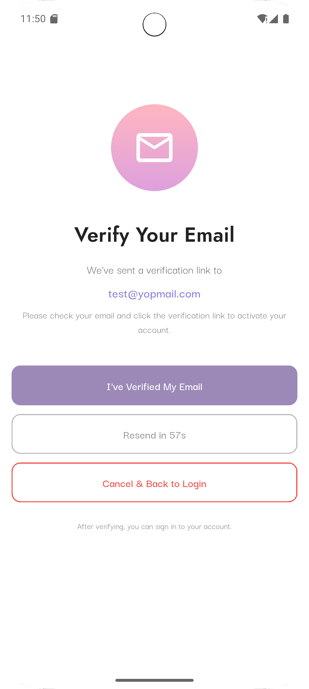
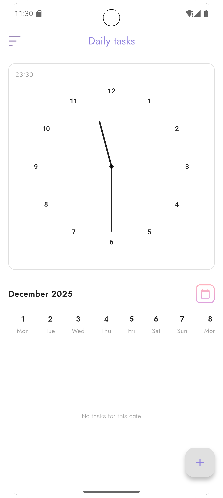
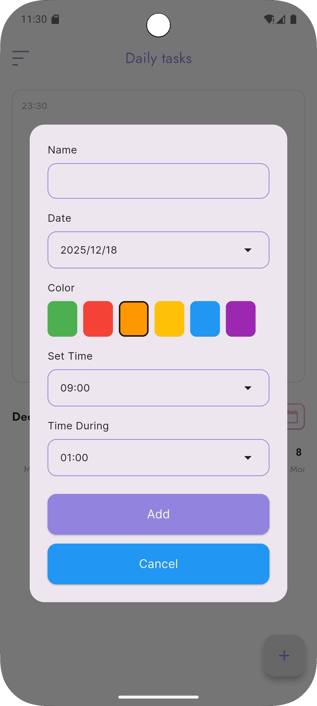
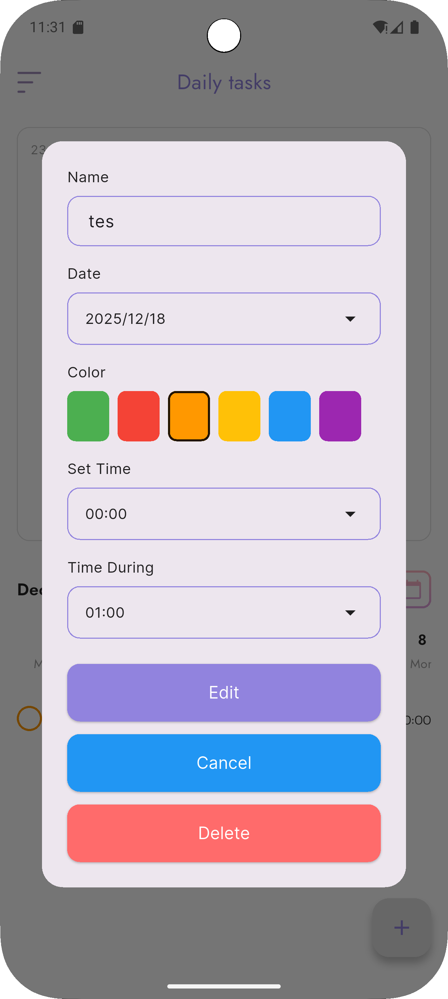
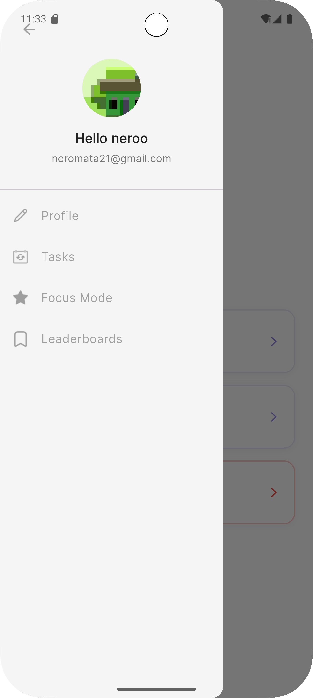
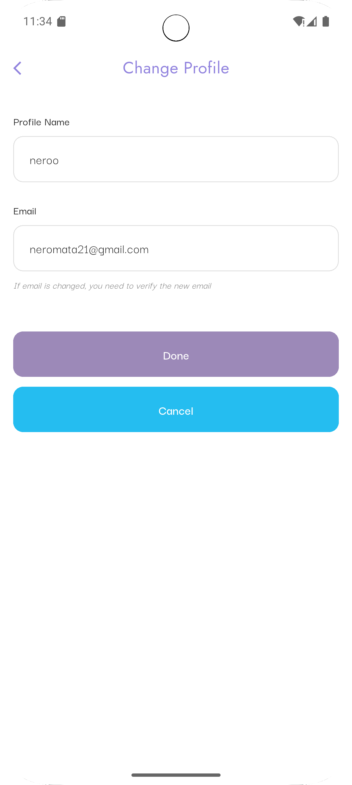
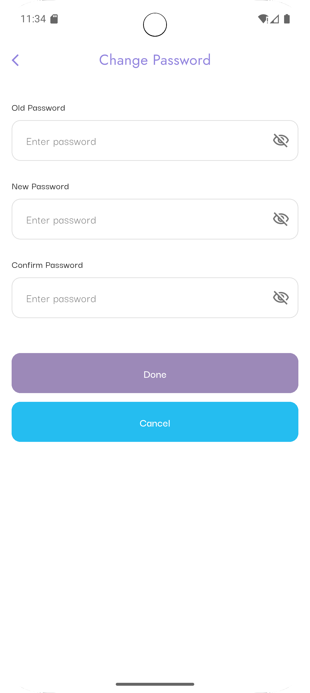
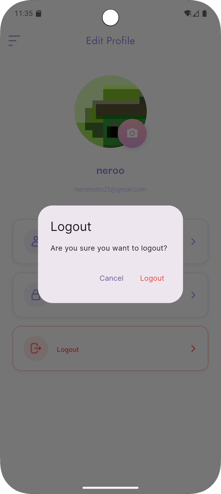

# Produktivia

**Produktivia** adalah aplikasi manajemen tugas dan produktivitas yang membantu Anda mengatur aktivitas harian dengan mudah dan efisien.

---

## 📱 Panduan Penggunaan

### 1. Login
Masukkan email dan password untuk masuk ke akun Anda.



---

### 2. Registrasi Akun Baru
Jika belum memiliki akun, klik "Register" dan isi data yang diperlukan.



---

### 3. Verifikasi Email
Setelah registrasi, cek inbox email Anda dan klik link verifikasi. Kembali ke aplikasi dan tekan "I've Verified My Email".



---

### 4. Halaman Utama (Home)
Setelah login, Anda akan melihat daftar tugas harian. Tugas dapat ditandai selesai dengan mencentang checkbox.



---

### 5. Tambah Tugas Baru
Tekan tombol "+" untuk menambahkan tugas baru. Isi judul, deskripsi, tanggal, dan waktu reminder.



---

### 6. Edit Tugas
Tekan tugas yang ingin diedit untuk mengubah detail atau menghapusnya.



---

### 7. Navigasi
Gunakan bottom navigation untuk berpindah antar fitur: Home, Focus Mode, Calendar, dan Profile.



---

### 8. Edit Profil
Masuk ke menu Profile untuk melihat dan mengedit informasi akun Anda.


---

### 9. Ubah Nama/Email
Klik bagian profil untuk mengubah nama tampilan atau email.



---

### 10. Ubah Password
Untuk keamanan, Anda dapat mengubah password melalui menu Profile.



---

### 11. Logout
Tekan tombol Logout untuk keluar dari akun Anda dengan aman.



---

## 🚀 Fitur Utama

- ✅ **Manajemen Tugas** - Tambah, edit, dan hapus tugas harian
- ⏰ **Reminder** - Notifikasi pengingat untuk setiap tugas
- 🎯 **Focus Mode** - Mode fokus untuk meningkatkan produktivitas
- 📅 **Calendar View** - Lihat tugas berdasarkan tanggal
- 👤 **Profile Management** - Kelola profil dan keamanan akun

---

## 📥 Download

Download APK terbaru di halaman [Releases](https://github.com/IINightingaleII/uas_pemob_produktivia/releases).

---

## 🛠️ Development

### Prerequisites
- Flutter SDK
- Android Studio / VS Code
- Firebase account (untuk authentication)

### Run Locally
```bash
flutter pub get
flutter run
```

---

**© 2025 Produktivia Team**
